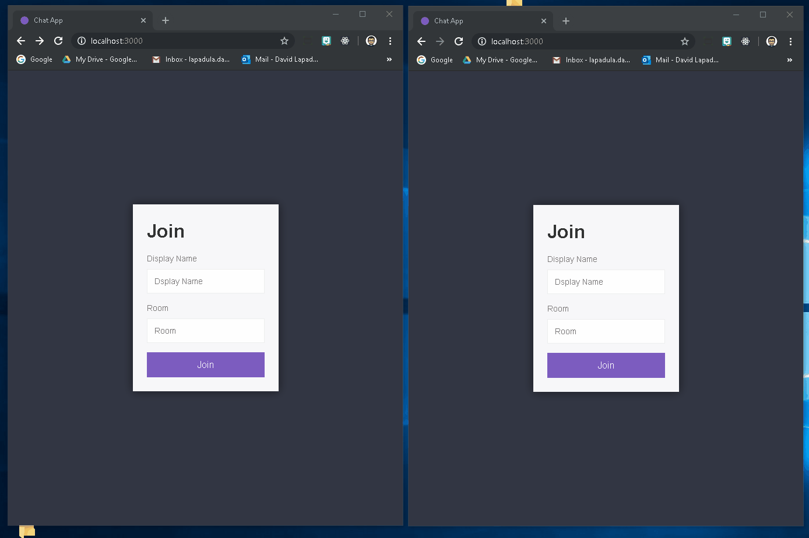

## Node practice projects

This repository is a collection of practice projects used for enhancing proficiency with mainly Node.js, as well as Express.js, MongoDB, and Socket.io

* **Chat Application** 
  - Simple chat applcation uses socket.io
    - Users can join rooms and send messages to each other
    - Program tracks users who are online

* **Task manager** 
  - Allows the users to store tasks, and add pictures to each task
    - Data persistency achieved with Mongoose/MongoDB

## Example Screenshot

### Basic Usage
***



## Tech/framework used

<b>Built with</b>
- [Node.js](https://nodejs.org/en/)
- [MongoDB](https://www.mongodb.com/)
- [Mongoose ORM](https://mongoosejs.com/)
- [Express Web Server](https://expressjs.com/)
- [Socket.io](https://socket.io/)

## Installation

### If you want to try the chat app on your local computer, or make your own copy: 

<b>First Install some necessary tools</b>
- [Node.js](https://nodejs.org/en/)
- [MongoDB](https://www.mongodb.com/)

```
1. Fork the repository and clone it into a folder on your computer. 
2. Navgiate to the root directory (cd chat-app) and run 'npm install' in the terminal'
3. Navigate into the 'src' directory (cd src) and run the command 'node index.js' in the termal
4. Open a browser and head to localhost:3000, and the app should display!
5. Open another browser and head to the same URL to see the chat funcitonality at work
```

## Acknowledgments

* Hat tip to Andrew Mead; I followed his Node.js course on Udemy to create these projects
* I recommend anyone interested in learning programming to take one of his courses; he is an excellent insructor. 
